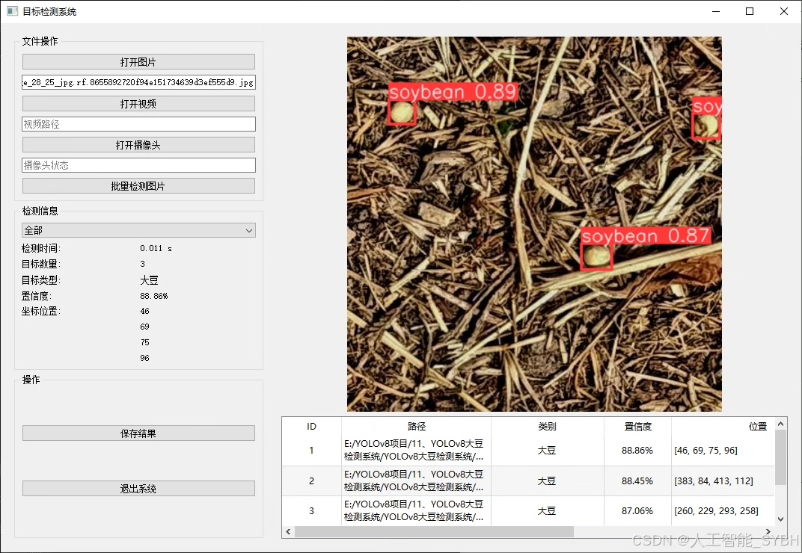
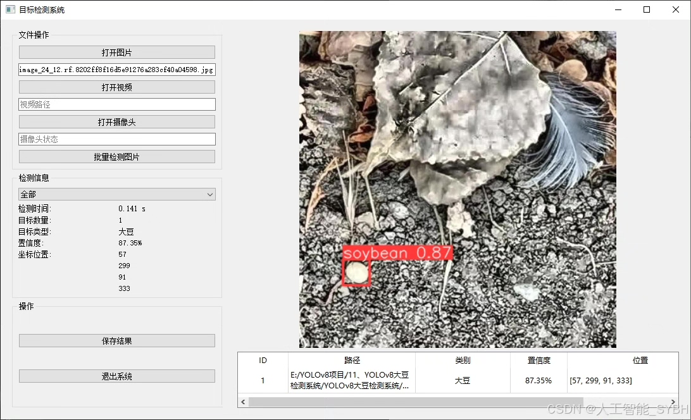
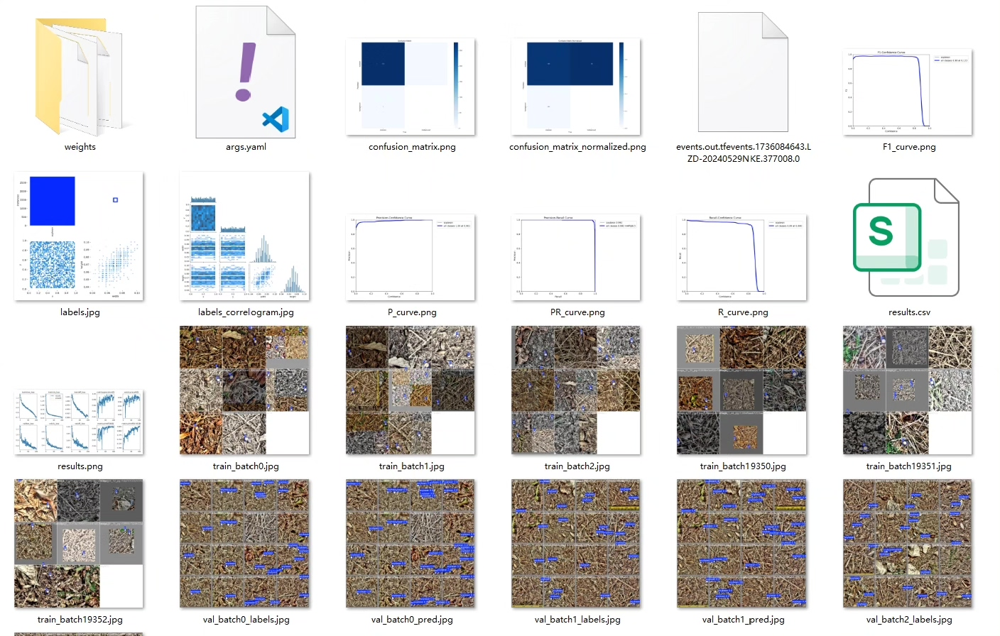
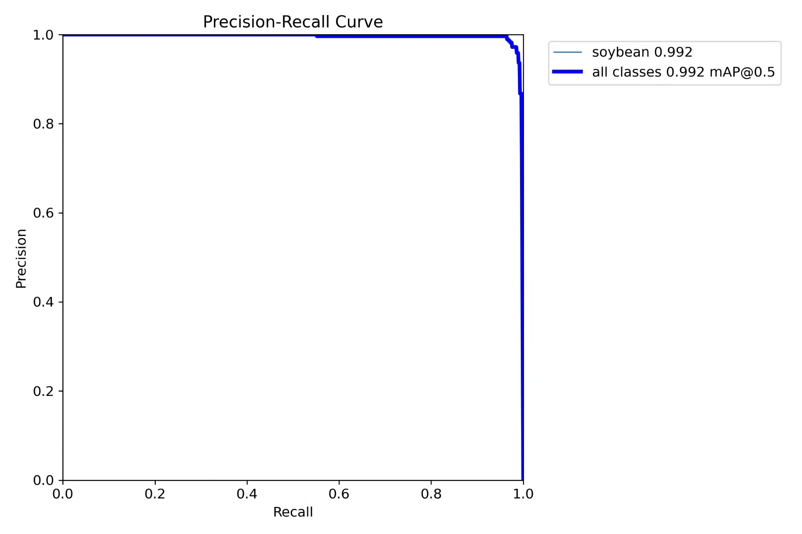
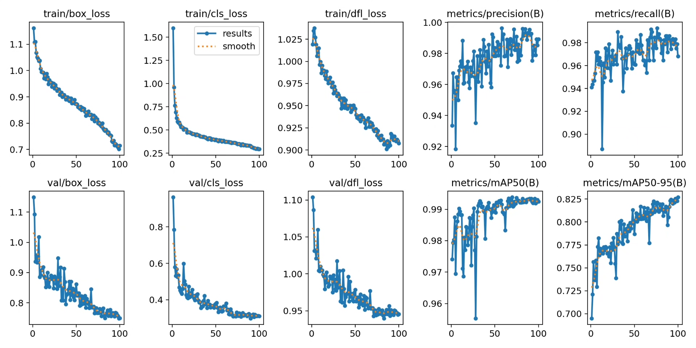
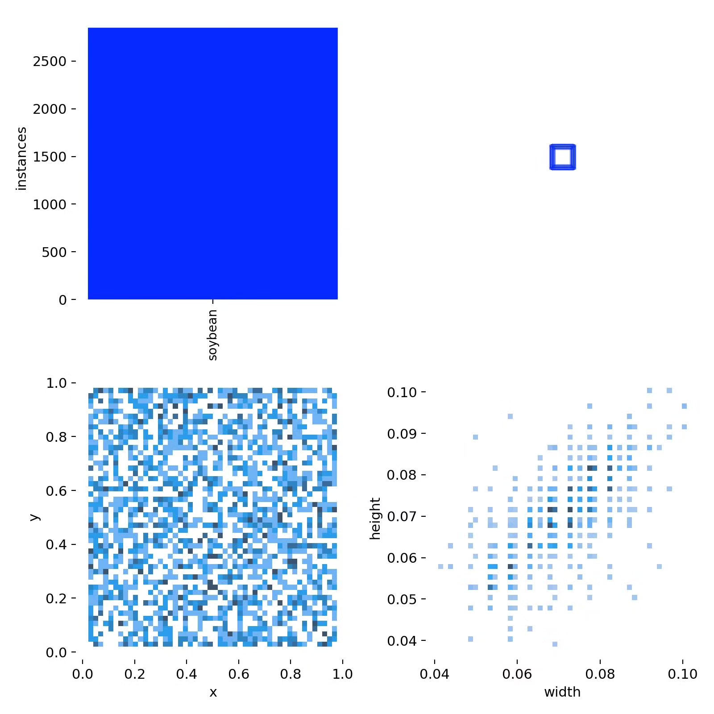
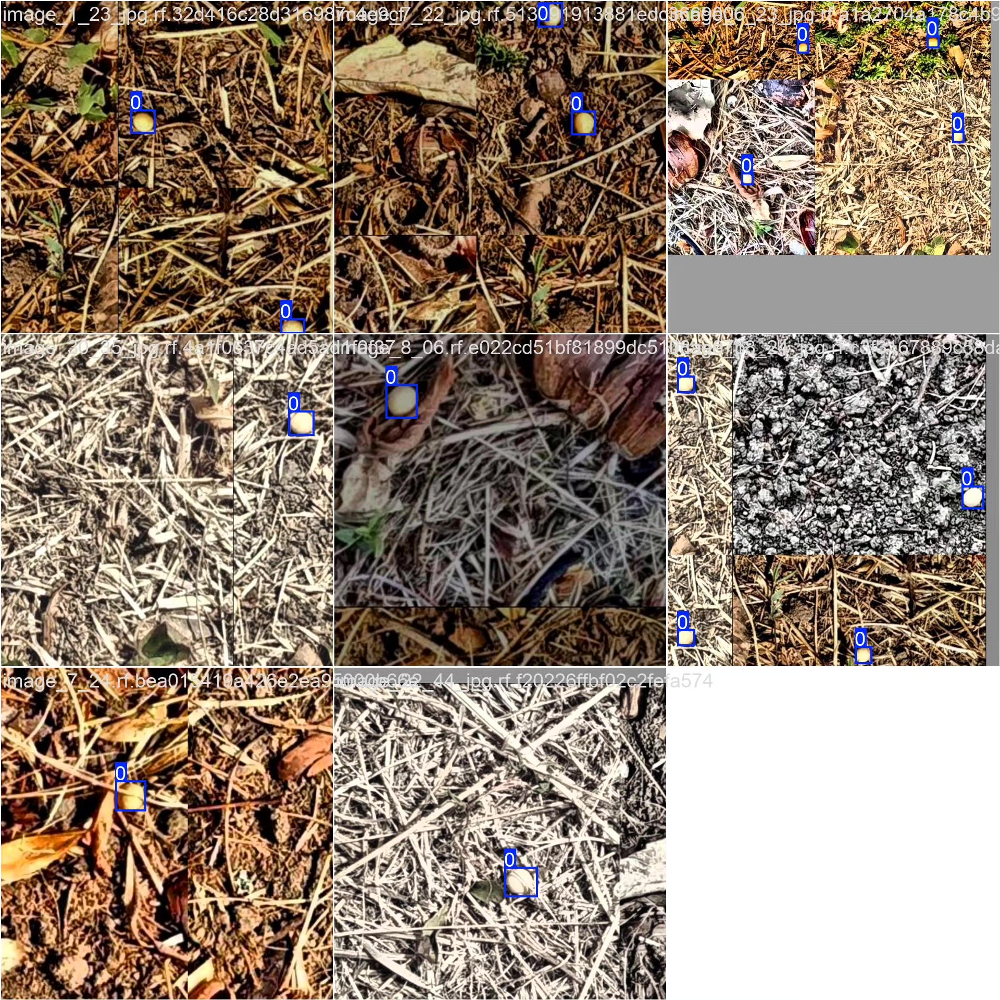
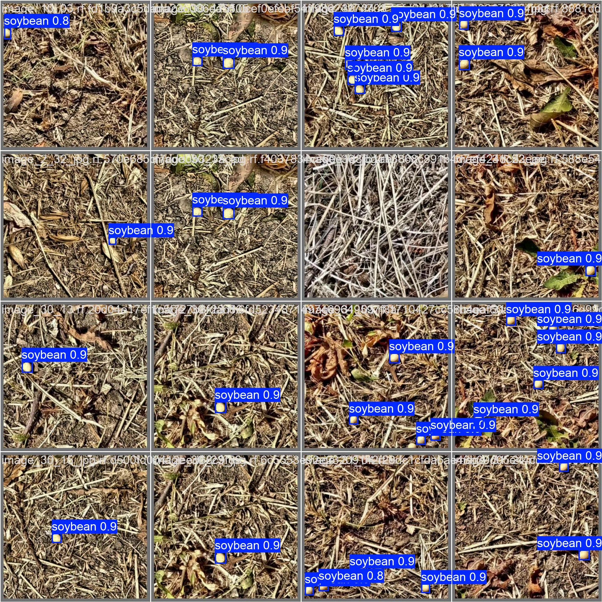

# Based on YOLOv8 deep learning for soybean detection system (YOLOv8+YOL)

## Body

Based on the advanced YOLOv8 object detection algorithm, this project has developed a set of intelligent systems specifically for soybean detection. The system is optimized for training on a single category "soybean" and uses a professional dataset containing 1984 images (including 1716 training images, 168 validation images, and 100 test images). The detection system can accurately and real-time identify soybean targets in image or video streams, providing efficient technical solutions for fields such as agricultural production, food processing, and quality control.

The company's products have obtained YOLO official commercial license certification.

We provide after-sales service.

After payment, we will provide WeChat IDs to answer questions anytime.

Environment configuration: We will provide an environment configuration tutorial, and WeChat will provide answers.

Remote installation services: If you need remote configuration, an additional fee of 69 is required, with all fees refunded if the configuration fails (only refunding installation fees for old computers).

Retraining dataset: After setting up the environment, you can train on your own computer. If you need us to retrain, just pay 69 plus computing power fees (2.5 yuan/hour).

Full after-sales service

## Images

## Payment

Here is a pay link on Stripe ( https://buy.stripe.com/3cs8yP7sY87d0vu9AB ). Please contact me lonlonago@foxmail.com after funding $89, and I will send you a complete data files , thank you!

